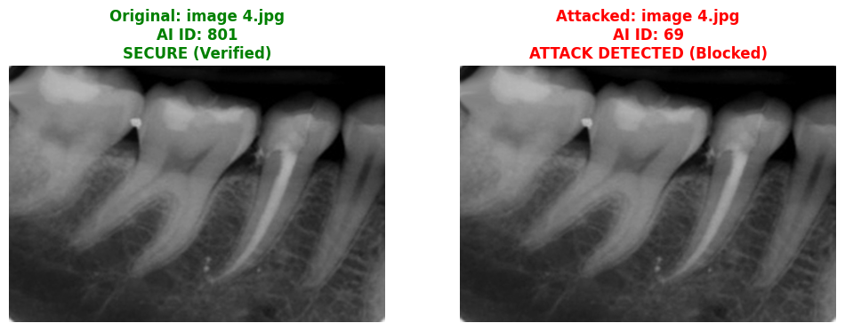
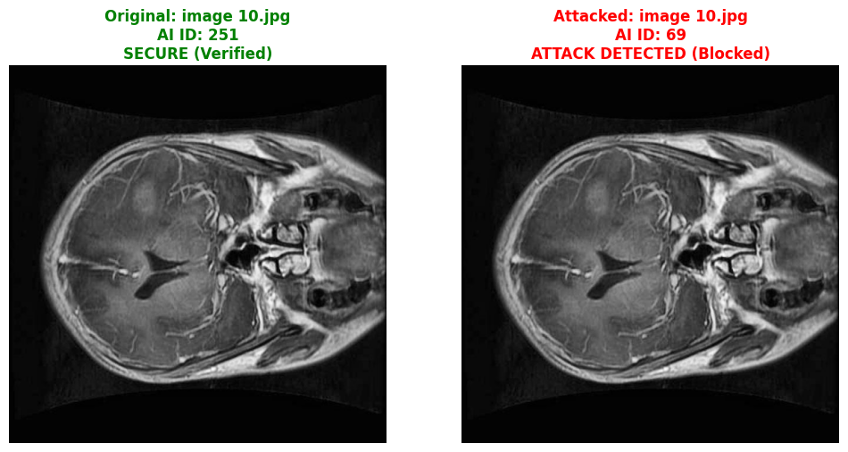

- Developed a defense model to preserve medical image integrity against adversarial AI attacks.
- Integrated Blockchain technology for data authenticity.
- Provided a fully reproducible pipeline for future research.

| Metric | Measured Value |
| :--- | :--- |
| **Min Latency** | 45.35 ms |
| **Max Latency** | 45.94 ms |
| **Average Latency** | 45.83 ms |
| **Throughput** | 400.6 TPS |
| **Total Transactions** | 1500 |
| **Block Finality** | 2035.07 ms |

| Case Study 01 | Case Study 02 | Case Study 03 |
| :---: | :---: | :---: |
|  |  |  |
| **Case Study 04** | **Case Study 05** | **Case Study 06** |
|  |  |  |
| **Case Study 07** | **Case Study 08** | **Case Study 09** |
|  |  |  |
| **Case Study 10** | **Case Study 11** | **Case Study 12** |
|  |  |  |
| **Case Study 13** | **Case Study 14** | **Case Study 15** |
|  |  |  |

git clone [https://github.com/rah9090/-Adversarial-AI-In-Medical-Imaging](https://github.com/rah9090/-Adversarial-AI-In-Medical-Imaging)

