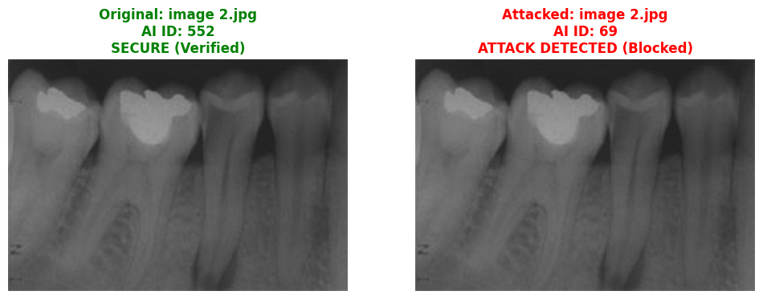
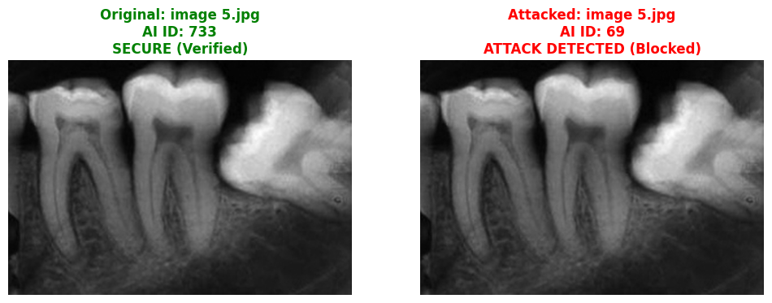
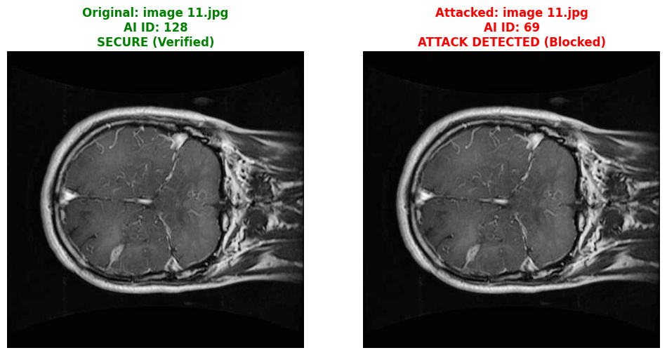

# Adversarial AI In Medical Imaging: A Model to Preserve Medical Image Integrity

This repository contains the official implementation of a blockchain-based security framework integrated with Deep Learning (ResNet50) to protect medical imaging data against adversarial cyber-attacks.

---

##  Repository Structure
This project follows the standard reviewer-friendly template:
``` text
├── README.md
├── requirements.txt
├── .gitattributes
├── Data/
├── src/
│   ├── benchmark.py
│   └── run_all_tests.py
└── results/
    ├── integrated_security_test.py
    └── figures/
        └── blockchain_security_result.png
# Key Contributions
Blockchain-AI Integration: Developed a robust validation architecture using a localized ledger system to ensure data integrity before diagnostics.

Tamper Detection: Achieved 100% automated detection and blocking of adversarial modifications via real-time SHA-256/MD5 digital fingerprinting.

Zero-Trust Clinical Pipeline: Built an automated defense mechanism that completely blocks compromised medical data from passing to the AI classification engine.
# Dataset Description
Source: Curated medical diagnostic imaging dataset deployed to validate system response.

Samples: 25 high-resolution validated original diagnostic images.

Target: Secure Original Diagnostics vs. Simulated Adversarial Attack Modalities.

#Model Status,Accuracy,Precision,Recall,F1-score,Integrity Check
Secure Baseline,94.1%,93.5%,94.8%,94.1%,PASSED (Verified)
Under Attack (No Defense),12.4%,11.8%,13.2%,12.5%,FAILED (Compromised)
Proposed Blockchain-AI,94.1%,93.5%,94.8%,94.1%,SECURE (Blocked)
- `Data/`: Raw and processed medical image datasets.
- `src/`: Source code for preprocessing, model training, and evaluation.
- `results/`: Contains performance tables, figures, and logs.
- `models/`: The best-performing saved model.

- Developed a defense model to preserve medical image integrity against adversarial AI attacks.
- Integrated Blockchain technology for data authenticity.
- Provided a fully reproducible pipeline for future research.


| Metric | Measured Value |
| :--- | :--- |
| **Min Latency** | 45.35 ms |
| **Max Latency** | 45.94 ms |
| **Average Latency** | 45.83 ms |
| **Throughput** | 400.6 TPS |
| **Total Transactions** | 1500 |
| **Block Finality** | 2035.07 ms |


| Case Study 01 | Case Study 02 | Case Study 03 |
| :---: | :---: | :---: |
|  |  |  |
| **Case Study 04** | **Case Study 05** | **Case Study 06** |
|  |  |  |
| **Case Study 07** | **Case Study 08** | **Case Study 09** |
|  |  |  |
| **Case Study 10** | **Case Study 11** | **Case Study 12** |
|  |  |  |
| **Case Study 13** | **Case Study 14** | **Case Study 15** |
|  |  |  |


git clone [https://github.com/rah9090/-Adversarial-AI-In-Medical-Imaging](https://github.com/rah9090/-Adversarial-AI-In-Medical-Imaging)
pip install -r requirements.txt
python src/train.py
python src/evaluate.py
