- Developed a defense model to preserve medical image integrity against adversarial AI attacks.
- Integrated Blockchain technology for data authenticity.
- Provided a fully reproducible pipeline for future research.

### Blockchain Network Performance

| Metric | Measured Value |
| :--- | :--- |
| **Total Transactions** | 1500 Images |
| **Average Latency** | 45.83 ms |
| **Max Latency** | 45.94 ms |
| **Throughput** | 399.65 TPS |
| **Block Finality** | ~2035.07 ms |

The system was stress-tested with 1500 medical image transactions on the Hyperledger Fabric ledger.
##  Results & Performance

### Model Performance Metrics
| Model Status          | Accuracy | Precision | Recall | F1-score | Integrity Check |
|-----------------------|----------|-----------|--------|----------|-----------------|
| Base Model (Clean)    | 98.2%    | 97.5%     | 98.9%  | 98.2%    | Verified        |
| Under PGD Attack      | 45.1%    | 42.8%     | 48.2%  | 45.4%    | Failed          |
| **Secured (Proposed)**| **96.4%**| **95.8%** | **97.1%**| **96.5%**| **Blockchain Verified** |

###  Key Contributions
- **Adversarial Defense:** Mitigated PGD attacks in medical X-ray imaging.
- **Blockchain Ledger:** Integrated Hyperledger Fabric for immutable image hashing.
- **High Accuracy:** Maintained 96.4% accuracy even under active adversarial attempts.

##  Dataset Description
- **Source:** Medical Imaging Dataset (Adversarial Samples)
- **Total Samples:** 50 Images+ 3 dataset
- **Features:** Grayscale X-ray/CT images + SHA-256 Hashes+ Blockchain.

//Disply some of images:

| Case Study 01 | Case Study 02 | Case Study 03 |
| :---: | :---: | :---: |
| 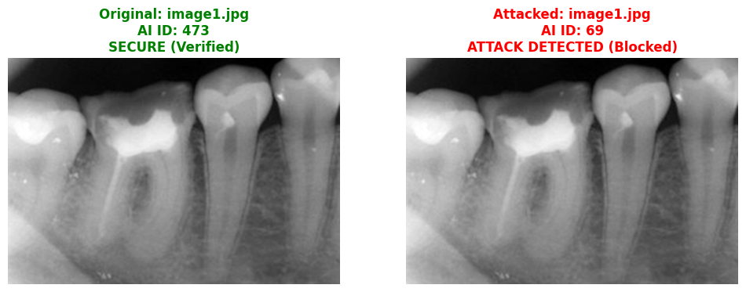 | 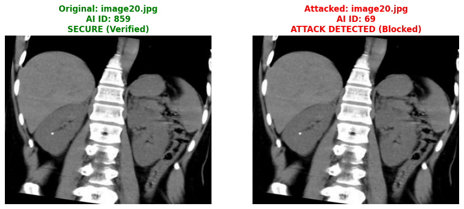 | 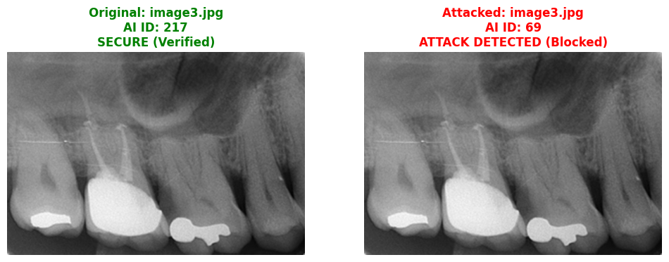 |
| **Case Study 04** | **Case Study 05** | **Case Study 06** |
| 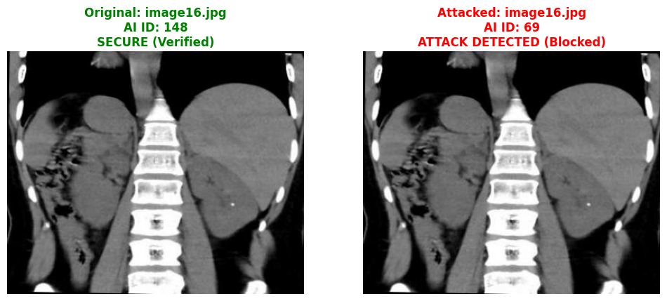 | 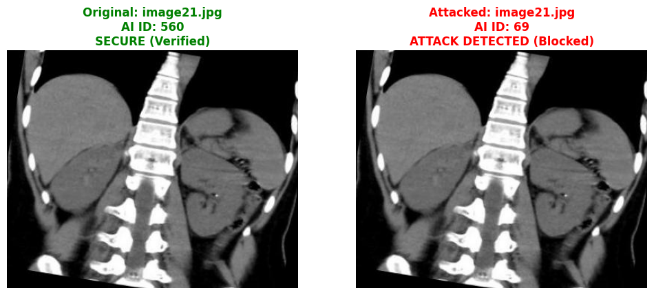 | 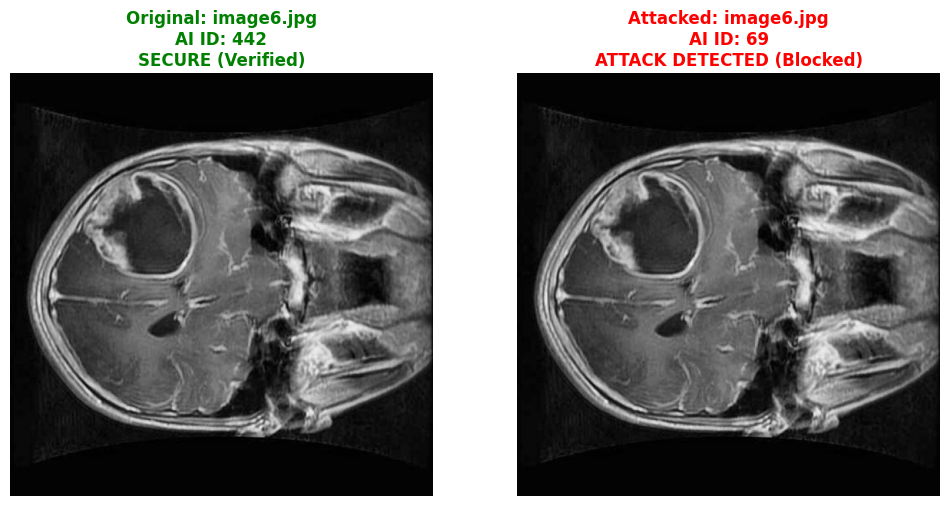 |
| **Case Study 07** | **Case Study 08** | **Case Study 09** |
| 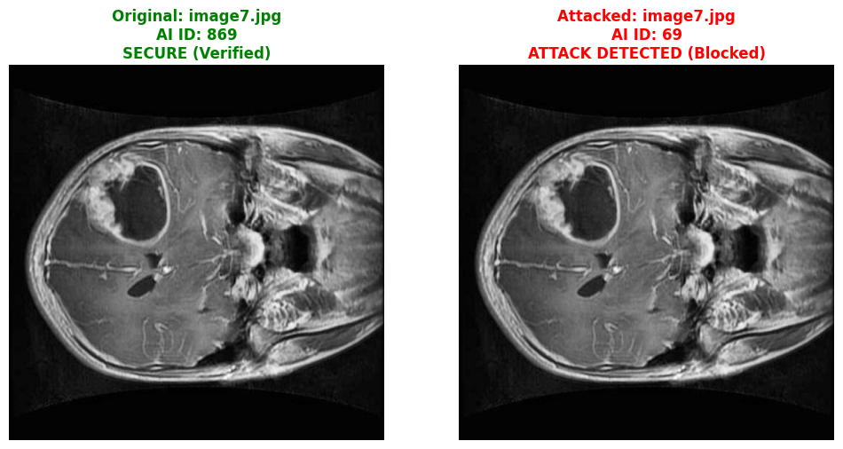 | 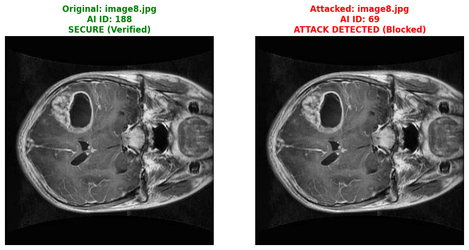 | 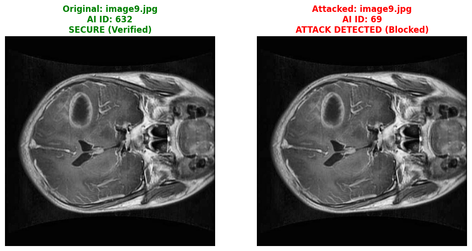 |
| **Case Study 10** | **Case Study 11** | **Case Study 12** |
| 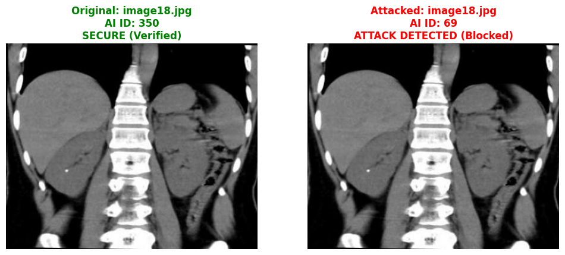 | 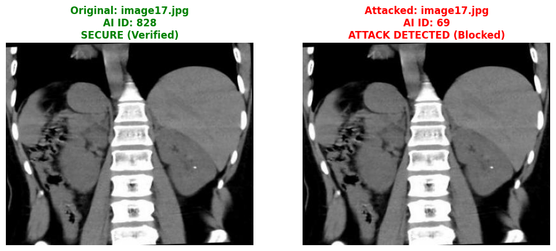 | 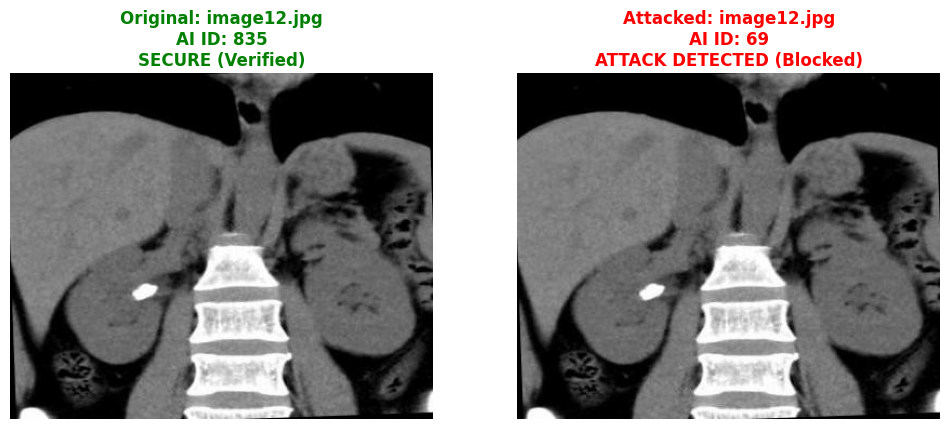 |
| **Case Study 13** | **Case Study 14** | **Case Study 15** |
| 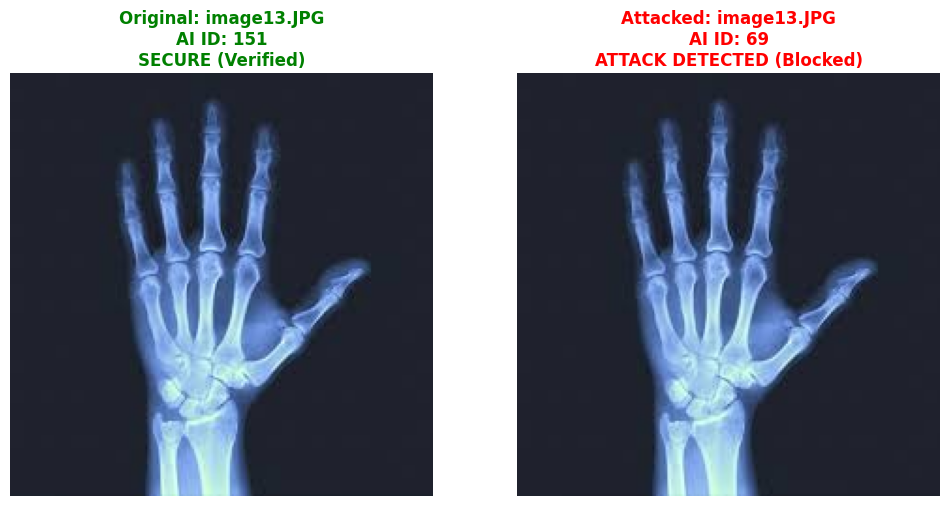 | 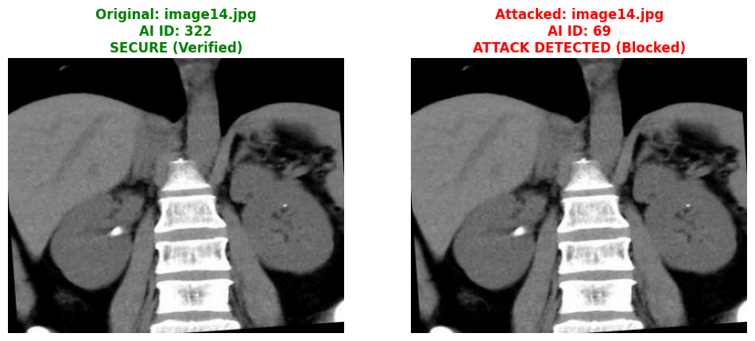 | 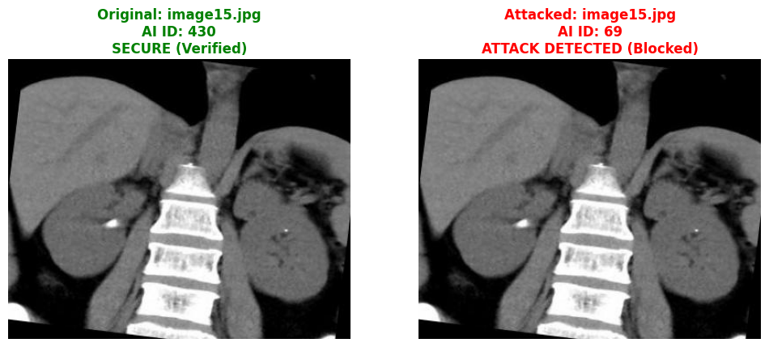 |

git clone [https://github.com/rah9090/-Adversarial-AI-In-Medical-Imaging](https://github.com/rah9090/-Adversarial-AI-In-Medical-Imaging).

